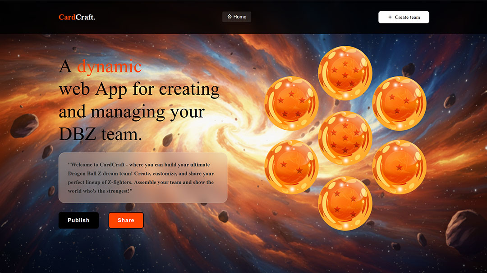

# 🐉 CardCraft - DBZ Team Builder

<div align="center">
  <p>
    <strong>Build and manage your ultimate Dragon Ball Z dream team with ease</strong>
  </p>
</div>

## 📸 Preview



## ✨ Features

<details>
  <summary><strong>🎮 Team Management</strong></summary>

- Create and customize your DBZ dream team
- Add team members with custom details and images
- Interactive team member cards with hover effects
</details>

<details>
  <summary><strong>🖌️ Interactive UI</strong></summary>

- Modern, clean interface with smooth animations
- Intuitive card-based design for team members
- Dynamic form for adding new team members
- Real-time updates to your team composition
</details>

## 🚀 Getting Started

1. **Clone the repository**

   ```bash
   git clone https://github.com/yourusername/CardCraft.git
   cd CardCraft
   ```

2. **Open in your browser**
   Simply open `index.html` in your favorite modern web browser

## 🛠️ Tech Stack

<details>
  <summary><strong>Frontend Technologies</strong></summary>

- **HTML5** - Semantic markup for structure
- **CSS3** - Modern styling with Flexbox/Grid
- **JavaScript (ES6+)** - For interactive functionality
- **Boxicons** - For beautiful icons
- **No Dependencies** - Lightweight and fast loading
</details>

## 🧪 Testing

<details>
  <summary><strong>Testing with Jasmine</strong></summary>

CardCraft uses Jasmine for unit testing to ensure core functionality works as expected.

- Just for personal learning purposes

</details>

## 🏗️ Project Structure

<details>
  <summary><strong>View Project Structure</strong></summary>

```text
CardCraft/
├── 📁 Assets/
│   ├── 📷 1.jpg
│   ├── 📷 3.png
│   ├── 📷 balls.png
│   ├── 📷 css.png
│   ├── 📷 gohan1.jpg
│   ├── 📷 html.png
│   └── 📷 js.png
│
├── 📁 scripts/
│   └── 📄 index.js
│
├── 📁 spec/
│   ├── 📁 support/
│   │   ├── jasmine-browser.mjs
│   │   └── jasmine.json
│   └── 📁 tests/
│       ├── prueba.spec.js
│       └── 📁 spec/
│           └── 📁 support/
│
├── 📁 styles/
│   ├── 📄 reset.css
│   └── 📄 styles.css
│
├── 📄 index.html
├── 📄 README.md
└── 📄 package.json
```

</details>

## 🎮 How to Use

1. **Create Your Team**

   - Click the "Create team" button in the navigation
   - Fill in the team member details
   - Add an image URL for the character
   - Click "Add to Team" to create the card

2. **Manage Your Team**

   - View all your team members in the cards section
   - Click on a card to remove the team member
   - The team updates in real-time

---

<div align="center">
  Made with ❤️ for DBZ fans everywhere
</div>
